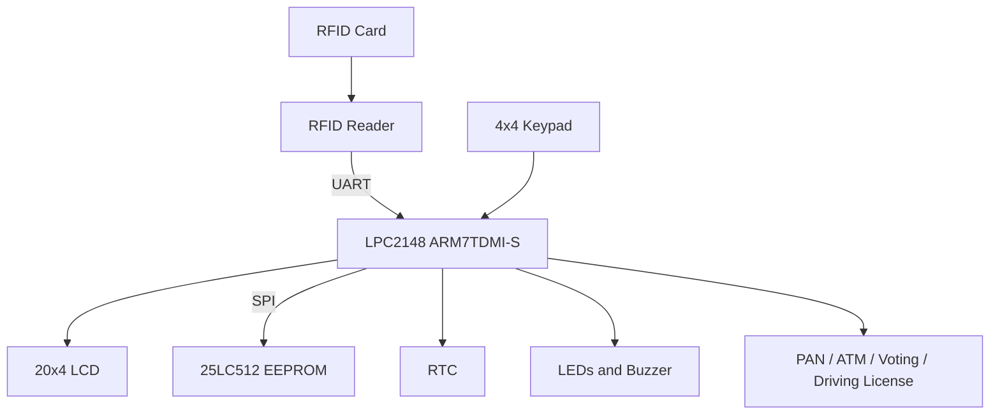
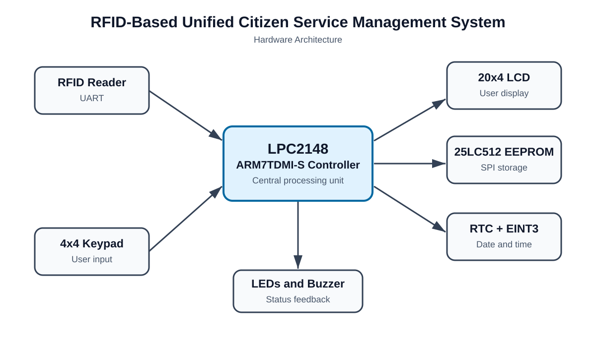
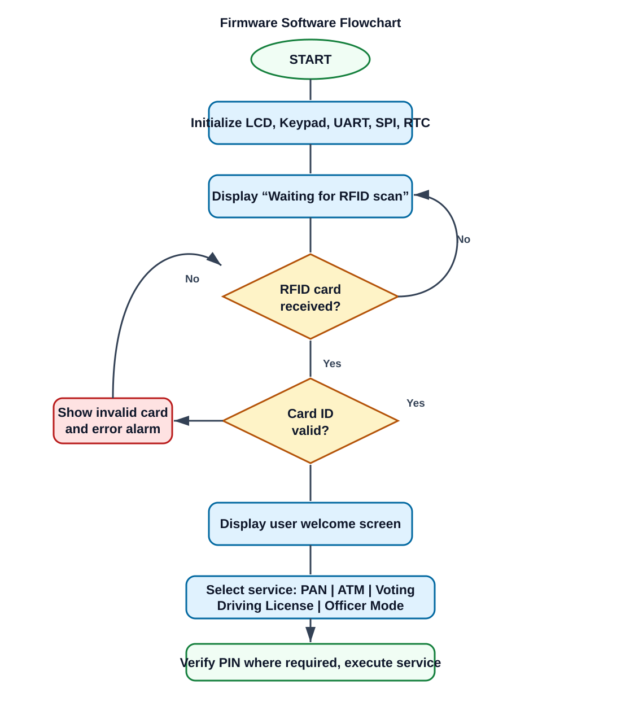
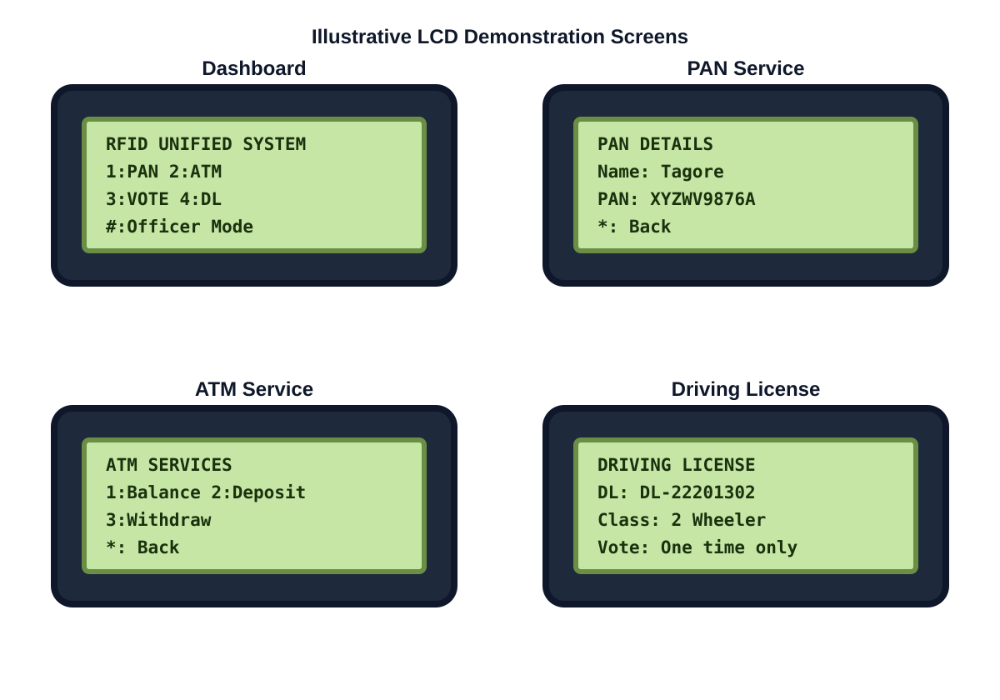

# RFID-Based Unified Citizen Service Management System

> An embedded system prototype that uses one RFID card to access multiple citizen-oriented services through an LPC2148 microcontroller.

## Project Objective

Citizens often use separate cards or identifiers for different services. This project demonstrates a **Unified Citizen Service Card** concept, where one RFID card authenticates a user and provides access to several services from a menu-driven embedded platform.

This is an educational prototype and does not connect to real government, banking, or identity systems.

## Features

| Feature | Description |
| --- | --- |
| RFID authentication | Validates an 8-byte RFID card ID before access is granted. |
| Secure PIN flow | Login and ATM actions use PIN verification with retry handling. |
| PAN service | Displays the authenticated user's PAN information. |
| ATM service | Supports balance enquiry, deposit, and withdrawal operations. |
| Digital voting | Records a vote state in persistent memory. |
| Driving license | Displays license number, vehicle class, and expiry data. |
| Persistent storage | Stores balances, voting state, and PINs in an external SPI EEPROM. |
| User feedback | Uses a 20x4 LCD, keypad, LEDs, and buzzer. |
| RTC support | Maintains date and time through the LPC2148 RTC. |

## System Architecture

## How It Works

1. The RFID reader sends the scanned card ID to the LPC2148 through UART.
2. The firmware checks the card ID against its citizen database.
3. A valid user is authenticated through a PIN where required.
4. The LCD shows the service dashboard.
5. The user selects PAN, ATM, voting, or driving-license functionality with the keypad.
6. Dynamic information, such as balances and voting status, is stored in the SPI EEPROM.

## Hardware Components

- LPC2148 ARM7 development board
- RFID reader and RFID cards
- 20x4 character LCD
- 4x4 matrix keypad
- 25LC512 SPI EEPROM
- LEDs and buzzer
- RTC support

## Software and Tools

| Item | Used technology |
| --- | --- |
| Programming language | Embedded C |
| Microcontroller | NXP LPC2148 (ARM7TDMI-S) |
| IDE | Keil µVision |
| Programming tool | Flash Magic |
| Communication | UART and SPI |
| Version control | Git and GitHub |

## Repository Guide

The current codebase is organized by module at the repository root:

| Module | Purpose |
| --- | --- |
| `Rfid.c`, `Rfid.h` | RFID reader initialization and card handling |
| `Rfid_test.c` | Application entry point and system initialization |
| `user_menu.c`, `user_menu.h` | Service dashboard, PAN, ATM, voting, and license workflows |
| `lcd.*`, `keypad.*` | LCD and keypad drivers |
| `uart.*`, `spi.*` | UART and SPI communication drivers |
| `spi_eeprom.*` | Persistent EEPROM storage |
| `Startup.s` | ARM startup code |
| `Docs/` | Project report, circuit diagram, and demonstration images |

## Build and Run

1. Open `RFID_PROJECT.uvproj` in Keil µVision.
2. Select the LPC2148 target and build the project.
3. Program the generated HEX file to the board using Flash Magic.
4. Connect the RFID reader, LCD, keypad, EEPROM, LEDs, and buzzer according to the hardware design.
5. Scan a registered RFID card to begin.

## Documentation and Demonstration

### Hardware architecture

### Software flowchart

### LCD demonstration

The following is an illustrative mockup of the project screens. Replace it with photographs from your real LCD setup when available.

Add your original circuit diagram, hardware photographs, and project report to [`Docs/`](Docs/). These will make the repository even stronger.

## Author

**A. Tagore**
